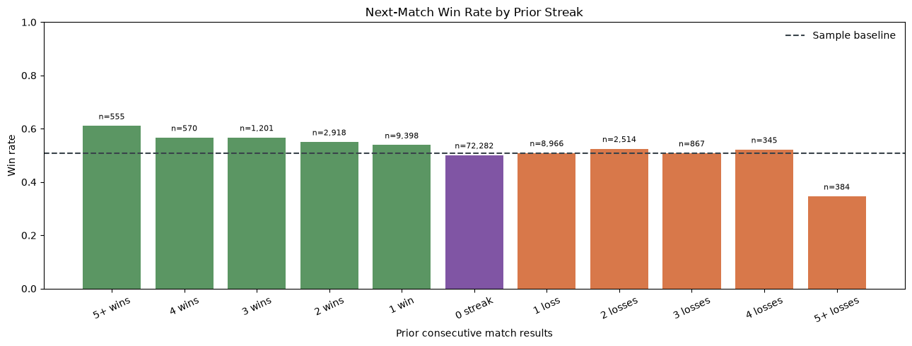
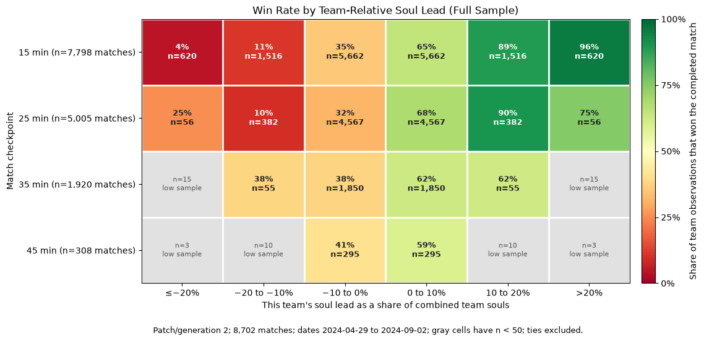

# Do Psychological Factors and Game State Predict Match Outcomes in Deadlock?

---

## 1. Problem Definition

- **Main question:** Do psychological factors predict match outcome beyond skill? How does their predictive value change as the match goes on?
- **Hypotheses:**
  - Players on loss streaks win their next game less often.
  - More experience on a hero increases win probability.
  - Players in parties win more often than solo players.
  - Psychological features matter most before the match, and their predictive value shrinks as in-game stats accumulate.
- **Who benefits:**
  - Game designers: matchmaking and "take a break" prompts.
  - Professional coaches and players: managing tilt.
  - Researchers studying resilience, practice, and teamwork.

According to a study, flow experience, attitude, perceived enjoyment, perceived behavioral control, and subjective norm are direct effects that facilitate the customers' continued intention to play online games. (Lee, M.-C., & Tsai, T.-R., 2010) Continued intention drives the player to perform, and this idea can be applied beyond gaming into other fields as well.

- **Why it matters:** The relationship between online game experience and players' cognitive functions has become increasingly important nowadays in the literature. Unfortunately, the association between online game experience and cognitive functions has not reached consensus. (Chang, Y., Liu, D., Chen, Y., & Hsieh, S., 2017)
- **Why a MOBA:** In contrast to such popularity and broad research interest in MOBA, the field of gaming expertise research is currently dominated by game genres such as puzzle games, action games, and first-person shooters. Compared to these types of games, MOBA is unique in that it requires a broader range of cognitive skills, from low-level ones such as hand-eye coordination to high-level ones such as strategical planning and team-working. (Ding, Y., Hu, X., Li, J., Ye, J., Wang, F., & Zhang, D., 2018).

---

## 2. Background and Context

- **Game Information:** Deadlock is Valve's 6v6 hybrid of a MOBA and third-person shooter. Players are placed on a large map with three primary lanes, two players each. Players aim to take objectives, three stationary tower-like enemies that represent progression. Each objective defeated gets you closer to the enemies base, which lets you defeat the game-ending objective known as the Patron. To get strong enough, players aim to increase their soul count - more commonly known as gold/currency in other MOBAs - by actively doing multiple tasks: eliminating opponents, eliminating neutral monsters in set map locations, and collecting boxes of souls. Games typically last between 25-60 minutes, giving us valuable psychological information as players have to adapt to plenty of mentally unfavorable situations.

Psychology sources at the bottom.

---

## 3. Data Description

- **Source:** [deadlock-api.com](https://deadlock-api.com), a community API built on Valve's game client data.
- **Pulling data:**
  - Collect match histories for a sample of players across ranks, which gives you streak and experience data.
  - Pull match metadata to get team stats at specific times. Check early whether the metadata includes stats at timestamps. If it only has end-of-match totals, drop the 20 and 30-minute snapshots and use pre-match versus end-of-game instead.
- **Report:**
  - Rows, number of players and matches, date range, patch, and game mode (ranked only is cleanest).
  - Missing values per column.
- **Limitations:**
  - Third-party data that may lean toward dedicated players.
  - Frequent balance patches.
  - Only public profiles are included.

---

## 4. Data Understanding and Exploration

- **Summary statistics:**
  - The statistics show that streaks do not happen often, as we go from almost 72,000 matches with no streak to around 2,500 matches on just a two-streak. (within the observed pages and date range). Alongside that, winning streaks have more impact while losing streaks do not make a significant impact outside of extreme situations.
  - Missing values are found on the second chart in terms of later games having low or no sample size. The longer the game goes on, the more comeback mechanics are in play. This forces games to gravitate to an even position, no matter how ahead a team was prior.
- **Target distribution:** When considering non-streaked matches, it sits at a near 50% which matches the target. Even with 1 and 2 wins or losses in a row, it still sits near the target. This helps assume that the average game is properly 50/50 balanced.
- **Patterns and outliers:** The heatmap suggests that greater relative gold advantage is associated with higher win probability, especially at 15 minutes. Later checkpoints have fewer matches and many low-count bins. The streak chart also varies by streak length, but the extreme streak groups have small samples.
- **Visualizations:** I use a win/loss count plot for target balance, the streak bar chart for the psychological proxy, and the heatmap for relative gold advantage by checkpoint. Boxplots can help inspect skew and outliers in numeric features.
- **Feature choices:** Compute streaks only from matches before the current one.

---

## 5. Data Preparation and Feature Selection

- **Feature engineering:** sort each player's matches by time, then compute these using only earlier matches:
  - Loss streak.
  - Previous result.
- **Game-state features:** build each snapshot only from stats up to that minute, as differences from the player's team to the enemy team (souls, kills, objectives). Compare it to if the team won in the end.
- **Cleaning:**
  - Remove duplicates, abandoned or very short matches, and players with too few matches.
  - Exclude volatile games that do not show a good representation of team leads.
- **Transformations:**
  - Log-transform or cap skewed counts.
- **Excluded features:** end-of-match totals (final kills, final souls, damage) because they leak the result, plus player IDs.

---

## 6. Baseline and Model Development

- **Baseline:** A majority-class classifier, which always predicts the most common outcome. It provides a simple benchmark for whether the trained models add predictive value.
- **Models:** Logistic regression and random forest, predicting whether a team wins from checkpoint minute and its relative soul lead.
- **Why these models:** Logistic regression tests whether these features have a useful, relatively simple relationship with wins. Random forest can capture more complex, nonlinear patterns.
- **Tuning:** Logistic regression tested `C` values of 0.1, 1, and 10. Random forest tested maximum depths of unlimited or 10 and minimum leaf sizes of 1 or 5, using 100 trees. Settings were compared with five-fold grouped cross-validation.
- **Fair comparison:** The data was split by match, not by individual team observations. Both teams and all checkpoints from a match stayed together, preventing match information from appearing in both training and test data.

---

## 7. Model Evaluation and Selection

- **Metrics:** Accuracy measures correct predictions; precision, recall, and F1 summarize positive-win predictions; ROC-AUC measures how well the model ranks winners above non-winners across thresholds.
- **Test results:**

| Model | Accuracy | F1 | ROC-AUC |
|---|---|---|---|
| Baseline (majority class) | 0.500 | — | 0.500 |
| Logistic Regression | **0.694** | **0.694** | **0.762** |
| Random Forest | 0.681 | 0.682 | 0.757 |

- **Final model:** Logistic regression.
- **Evidence:** It had the highest grouped cross-validation ROC-AUC (0.775 versus 0.769 for random forest) and also performed best on the held-out test set.
- **Tradeoffs:** Random forest can capture more complex patterns, but it did not outperform logistic regression here. Logistic regression was slightly better on the reported test metrics and is simpler to interpret.

---

## 8. Model Interpretation and Insights

- **What the model learned:** A team's relative soul lead is strongly related to whether it wins. A larger lead corresponds to higher odds of winning. Match minute had very little influence in these models.
- **Most influential features:** Soul lead was the strongest feature. The logistic regression coefficient was 1.852 per standard deviation of soul lead, which corresponds to about 6.375 times the win odds, holding minute constant. This is an odds change, not a 6.375 times increase in win probability. The random forest also ranked soul lead as much more important than minute: 98.7% versus 1.3%.
- **Where it performs well or poorly:** It performed best at 15 and 25 minutes, with 70.8% accuracy and ROC-AUC scores of 0.793 and 0.764. Performance was weaker at 35 minutes (62.1% accuracy) and 45 minutes (59.7%). The 45-minute result is less certain because it has only 134 test observations.
- **What the confusion matrix shows:** On the held-out data, logistic regression correctly predicted 2,119 losses and 2,119 wins. It incorrectly predicted 934 wins as losses and 934 losses as wins.

|  | Predicted Loss | Predicted Win |
|---|---|---|
| **Actual Loss** | 2,119 | 934 |
| **Actual Win** | 934 | 2,119 |

- **What the coefficients and feature importance show:** Both methods point to soul lead as the main predictor. The logistic regression's minute coefficient rounds to 0.000, and the random forest assigns minute only 1.3% importance.
- **What the probability errors and examples show:** The average absolute difference between predicted win probability and actual outcome was 0.364 at 15 minutes, increasing to 0.469 at 45 minutes. For example, a team with a 6.2% lead at 45 minutes was predicted to win with 73.2% probability and did win. A team nearly even but slightly behind at 25 minutes was predicted to lose with 49.1% probability, but it won. Predictions near 50% are especially uncertain.
- **What we can conclude:** Soul lead is a useful predictor of a team's eventual win in this sample, especially earlier in the match.
- **What we cannot conclude:** These results do not show that gaining souls causes a win, or that the same performance will hold for other patches, dates, or samples. The model uses only checkpoint minute and relative soul lead, so it does not account for other factors that may affect a match.

---

## 9. Limitations, Ethics, and Reflection

- **Bias:**
  - Sampling bias toward tracked players.
  - Disregarding the patch, different patches have altered the amplitude of comeback mechanics.
  - Possible matchmaking effects, since the system may give losing players easier opponents and hide or reverse tilt effects. However, this is often a myth and can only be truly confirmed if the developers say.
  - Treating team outcomes as individual rows.
- **Prediction errors:** In matchmaking or professional play, a false "likely to lose" label could demotivate players and unfairly alter their mindset.
- **Real-world use:** Appropriate for research about mental wellness in competitive fields or games.
- **Privacy:** No specific player data is given or shown. All player data is publicly available, but for the purpose of this research study, no player IDs or references will be shown.
- **Transfer to real life:** Gaming behavior may not fully carry over to work or school settings.
- **Next steps:**
  - Track psychological effects across patches.
  - Add chat or behavior data if it becomes available.
  - Try adding in rank information to determine if rank can affect any factors.

---

## 10. Code and Transparency

- **Repository structure:**
  - `data-structures-portfolio/research/2026/deadlock`
- **Data citations:** [deadlock-api.com](https://deadlock-api.com) and its API documentation.
- **AI disclosure:** AI tools were used adhering to course policy. Claude was used in producing and refining an outline as well as helping analyze the data, and GitHub Copilot was used in supporting code creation. Creative decisions, such as the research question, game information, and context that requires game knowledge and interpretation, among other things, were decided/created by myself.

---

## References

Chang, Y., Liu, D., Chen, Y., & Hsieh, S. (2017). The Relationship between Online Game Experience and Multitasking Ability in a Virtual Environment. Applied Cognitive Psychology, 31(6), 653–661. https://doi.org/10.1002/acp.3368

Ding, Y., Hu, X., Li, J., Ye, J., Wang, F., & Zhang, D. (2018). What Makes a Champion: The Behavioral and Neural Correlates of Expertise in Multiplayer Online Battle Arena Games. International Journal of Human-Computer Interaction, 34(8), 682–694. https://doi.org/10.1080/10447318.2018.1461761

Lee, M.-C., & Tsai, T.-R. (2010). What Drives People to Continue to Play Online Games? An Extension of Technology Model and Theory of Planned Behavior. International Journal of Human-Computer Interaction, 26(6), 601–620. https://doi.org/10.1080/10447311003781318
